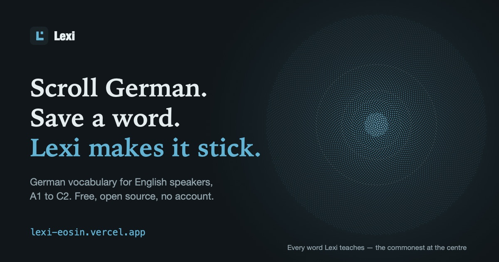

# Lexi

**Scroll German. Save a word. Lexi makes it stick.**

A free, open-source German vocabulary app for English speakers: **10,000+ words** from
A1 to C2 to learn, and a dictionary of **93,000+** headwords to look things up in. No account,
no ads, nothing to cancel — and your progress stays on your device.

**[Open Lexi →](https://lexi-eosin.vercel.app)** — it runs in the browser; add it to your
home screen and it works offline.

[](https://lexi-eosin.vercel.app)

## Who it is for

English speakers **living with German** — past the course, somewhere between A2 and B2,
who want to read the news and the letter from the *Ausländerbehörde* without a
dictionary open. It works from A1, but Lexi teaches **words, not grammar**: if you are
starting from zero, use it beside a course, not instead of one.

## What makes it different

- **Nothing to pass.** Lexi opens on a German word, not a quiz: one word per screen,
  with its sound, its meaning and an example, and nothing is graded until you ask.
  Every few words there is a German news story on topics you choose (tagesschau, SRF,
  DW, heise), fetched by your own browser — tap any word in it to save it.
- **You choose what you learn.** Save a word and **Üben** (practice) brings it back
  just before you would forget it — FSRS spaced repetition. Cards say *why* they are in
  front of you, and recognising a word and producing it (typed, article included) are
  scheduled separately, because recognising is only half of knowing.
- **Checked, not generated.** Gender, plural, part of speech and pronunciation come
  from Wiktionary, never from a model, and a new card is refused outright if any of them
  disagrees with de.wiktionary or its example sentence does not contain the word.
- **Lexi in your ears.** *Walk* turns a session into audio for a walk or a run, 5 to 60
  minutes: hear the English, say the German aloud, then hear it. You grade with your
  headphone buttons; silence grades nothing, and your voice is never scored.
- **Your German, as a sky.** Every word Lexi teaches is a star, the commonest at the
  centre, and the ones you know are lit as brightly as you would recall them today.
  Share it — the picture carries the link.
- **Yours.** No account, no tracking, no ads. Progress lives in your browser's storage
  (back it up from Settings). An optional tutor explains sentences on *your own* AI key,
  and is off until you add one. The code is MIT; the corpus is CC BY-SA, every source
  recorded in [`ATTRIBUTIONS.md`](ATTRIBUTIONS.md).

## How it compares

Lexi is small on purpose. What the others do better is real, and worth saying:

| If you use… | it is better at… | Lexi is different because… |
|---|---|---|
| **Duolingo** | a whole course — grammar, listening, speaking — as a daily game | it is only vocabulary, for adults, with no game to win or lose, and it goes deep at B1–C1 |
| **Anki** with a shared deck | anything, in any language, exactly your way | there is no deck to build or debug, and every gender and plural is checked |
| **LingQ, Readlang** | reading any text you bring | a word counts as known when the scheduler's evidence says you would recall it, not when you mark it — and it is free |

> **What Lexi deliberately does not do** — teach grammar, mark your speech, run leagues,
> or say "you can now…" from a word count. *Ruled 2026-09-05:* a drill earns its place
> if it tests a property of the **word** (gender, plural, spelling, the German you have
> to produce) and goes if it tests a **rule of the language**. Every gloss is in
> English; other language pairs are an architectural goal, not a shipped feature.
> [`docs/VISION.md`](docs/VISION.md) carries the whole argument, including what it would
> take to reverse each refusal.

## Docs

[`docs/VISION.md`](docs/VISION.md) is the anchor — what this is, what it refuses, and
what is still undecided. [`docs/BACKLOG.md`](docs/BACKLOG.md) is what's next;
[`docs/CHANGELOG.md`](docs/CHANGELOG.md) is what shipped and why. Full index at
[`docs/README.md`](docs/README.md).

## What's inside

Measured against the shipped corpus on 2026-09-26. The two headline counts are
guarded by `src/lib/publicCopy.test.ts`, which fails when the corpus outgrows them.

- **10,000+ word cards** across all six CEFR levels, every one with **at least two
  usage examples**, German and English, and all but a handful with IPA.
- Cards carry a gloss, gender and plural, synonyms and antonyms, word family and — from
  B2 — a German-language definition.
- **93,000+ dictionary headwords** answer what the cards do not, kept visibly apart:
  an entry is an unverified Wiktionary gloss you can look up and note, never study.
- **274 topic sectors**, rolled up into broad theme groups for browsing and the heatmap.
- **FSRS** scheduling via `ts-fsrs`. Every drill mode is its own track, so *recognising*
  a word and *producing* it are scheduled separately — that split is what makes the
  recall drill honest.
- **Local-first**: progress lives in IndexedDB with export/import for backup and moving
  between machines.

## Surfaces

Four destinations, and the first one is where the app opens.

- **Wörter** — *the feed.* One German word per screen, scrolled: the headword with its
  article inked by gender, the IPA as a pill you press to hear it, the meaning, and one
  example sentence. Three actions — ⓘ opens everything the corpus knows, **🔖 saves the
  word to your next session**, and 🎓 practises it now. The feed does not grade you:
  scrolling is not evidence, so nothing here touches your schedule. The order is the scheduler's,
  though — what's due, then unseen words from your thinnest topics, then the rest by
  frequency.
- **Themen** — *what words are there?* A search over every card (German or English,
  umlauts optional), the theme groups with your coverage on each, **Decks**, the
  **Wortkarte** (a semantic map of a sector, with synonym links and node colour by
  learning status), and **Wörter aus einem Text** — paste any German you want to read
  and it says how much of it you can read, which words are in the way, and builds a
  session out of them.
- **Üben** — *test me.* Flip cards interleaved with the three word-fact drills, on one
  FSRS queue that opens with the words you bookmarked. Interval previews on the grade
  buttons, German text-to-speech on every string, a hint ladder and near-miss tolerance
  on typed answers, and a line under each item saying *why it is here* ("you flipped
  *anbieten* a few cards ago — now produce it"). Silence when there is nothing
  non-obvious to say.
- **Fortschritt** — *how is it going?* **Dein Deutsch**, the sky of every word Lexi
  teaches with the ones you know lit, a replay of how it filled, and each word's own
  memory curve; words you know, the two-minute placement test, the
  A1→C2 level path (which is also the control that decides what you are shown), your
  goal, the knowledge heatmap, review and recall history, the 7-day due forecast,
  finished sectors, and **blind spots** — what you keep getting wrong, ranked by rate,
  each row a tap into a run of that drill.
- **Profile**, off the avatar — name, level, streak, goal, topics, flagged cards, and
  **Settings**: theme, text size, review intensity (FSRS desired retention), daily pace,
  which drills are in a session, the HD German voice, and backup / restore.

### The loop

> **browse freely → save what catches you → Üben teaches you what you chose.**

Bookmarking is the one thing a feed can honestly record, and it is an instruction to the
scheduler rather than a wishlist: `buildBriefing` serves saved words ahead of the ones it
would have picked itself.

**Walk** — *On a walk* on the saved-words sheet, or `?walk` — is the day's queue as audio for
a walk or a run: the English, a cue tone, a pause to say the German aloud, then the
German. Only a deliberate headphone press grades — next track *knew it*, previous track
*didn't* — and a word met for the first time is taught before it is tested. See
`src/lib/walk.ts`.

### The three drills

Each is generated from the lexicon and scheduled on its own FSRS track under
`gym:<mode>:<wordId>`.

| | Asks | Why it is vocabulary and not grammar |
|---|---|---|
| **der / die / das** | the article of a noun | a German noun without its gender is a half-learned word |
| **Plurals** | `die Tische`, not `die Tischen` | same |
| **Recall** | English in, German out — typed, with the article | the productive half of knowing a word, which recognition never proves |

Recall is gated: a word becomes eligible only once its flip card has reached FSRS
`Review`, because asking someone to produce a word they have only just met is a
retrieval attempt on something not yet encoded.

## Stack

Vite 6 · React 19 · TypeScript · Tailwind CSS v4 · `motion` · `lucide-react` · `ts-fsrs`.

## Run

```bash
npm install
```

```bash
npm run dev
```

Then open `http://localhost:5173/lexi/` — the base path is `/lexi/` locally and `/` on
Vercel.

```bash
npm run build      # production bundle to dist/
npm run typecheck  # tsc --noEmit
npm test           # vitest — the pure logic, the shipped corpus, and the public copy
npm run lint       # eslint, including jsx-a11y
```

Before pushing anything that touches the corpus:

```bash
npm run corpus:validate && npm run corpus:selftest
```

## Repository layout

```
src/            the app — views/, components/ (+ ui/ primitives), lib/, data/
public/data/    the shipped corpus: cards.json, detail.json, sectors.json, freq.json,
                provenance.json, audio.json (vocab.json is canonical, not deployed)
scripts/corpus/     build-time ingestion, audits and one-shot corpus fixes (npm run corpus:*)
scripts/authoring/  the verified card-authoring loop: batch in, machine-gated, audit trail
docs/           VISION (the anchor) · BACKLOG (open) · CHANGELOG (shipped, with reasoning)
design/         logo sources
```

Nothing under `scripts/` ships to the browser: it runs on a maintainer's machine and
writes `public/data/*.json`, which the app fetches at runtime. **Corpus JSON is never
hand-edited** — every change goes through a script so it is reviewable and repeatable.

## Data

`public/data/` is served as static files and fetched at runtime (see
`src/data/index.ts → initData`) so the corpus isn't parsed inside the JS bundle — the
app shell paints immediately and the service worker caches the data for offline reloads.
To extend coverage, use the reproducible pipeline in
[`scripts/corpus/`](scripts/corpus/README.md): `npm run corpus:coverage` to see the gap,
`corpus:build` to grow it from open sources.

`vocab.json` still carries 110 `kind: 'grammar'` cards. They are filtered out at load in
`src/data/index.ts` rather than cut from the corpus, because the corpus is canonical and
reversing the decision should be one line.

## Install as an app (PWA)

Lexi ships a web app manifest and a service worker, so it installs on phone and desktop,
runs full-screen and works offline after the first load. `navigator.storage.persist()`
runs at boot — without it Safari evicts IndexedDB after about a week of not opening the
app, which for a local-first tool is total data loss.

## Licence

**The code is MIT** — see [`LICENSE`](LICENSE).

**The corpus** (`public/data/*.json`) is built from Wiktionary/Wiktextract, Tatoeba and
the Leipzig Corpora Collection, and carries **CC BY-SA 4.0** with attribution. Every
source, its licence, and exactly what is redistributed is recorded in
[`ATTRIBUTIONS.md`](ATTRIBUTIONS.md) — if you fork this, that file travels with it.

## Contributing

See [`CONTRIBUTING.md`](CONTRIBUTING.md). The short version: the corpus is never
hand-edited, tests and `corpus:validate` gate every merge, and
[`docs/VISION.md`](docs/VISION.md) lists what the project deliberately refuses to build.

## Notes

Coverage colour uses FSRS state: a card counts as *learned* once it leaves `New` and
*consolidated* once it reaches `Review`. New-card introductions are capped per day, at a
pace you can change. Respects `prefers-reduced-motion`, honours iOS Dynamic Type, and
pairs every colour signal with a shape or a label so nothing rides on hue alone.
